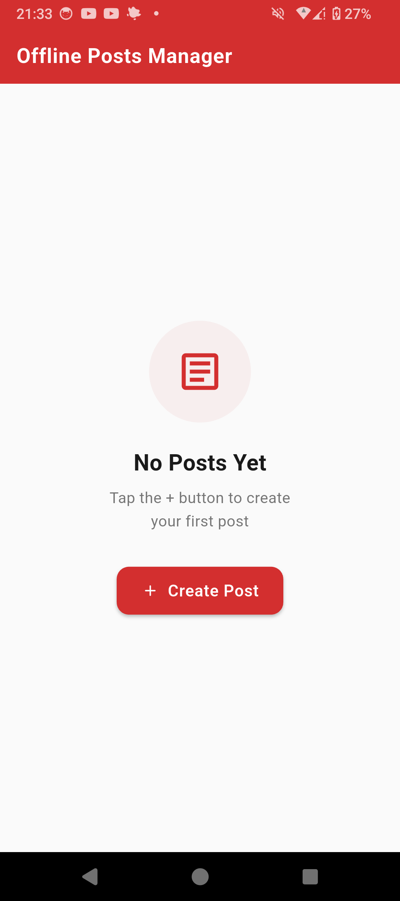

#  Offline Posts Manager (Flutter + SQLite)

##  Overview
**Offline Posts Manager** is a Flutter mobile application developed as part of **Flutter Lab 5**.  
The app allows staff of a media company to manage posts without requiring an internet connection by storing all data locally using SQLite.

## Brief Demo
<p align="center">
  
  
  
</p>
---

## Objective
The goal of this project is to practice:
- Local database integration using SQLite
- Performing CRUD (Create, Read, Update, Delete) operations
- Managing stateful UI updates in Flutter

---

## Features
The application provides the following functionalities:

-  View all locally stored posts  
-  Read details of a selected post  
-  Add new posts  
-  Edit existing posts  
-  Delete posts  

---

## Technologies & Dependencies

- **Flutter** – UI development framework  
- **sqflite** – Local SQLite database operations  
- **path** – File path management  

###  Why SQLite?
SQLite is used because it:
- Enables **offline data storage**
- Provides **persistent storage**
- Is **lightweight and efficient**
- Supports structured data using tables

---

##  Database Structure

- **Database Name:** `posts.db`  
- **Table:** `posts`  


## 🔄 CRUD Operations

- **Create:** Add new posts to the database  
- **Read:** Retrieve and display all posts  
- **Update:** Modify existing posts  
- **Delete:** Remove posts from the database  

---

## Exception Handling

The app handles database-related errors as follows:

- ❗ Database not initialized → Ensures initialization before use  
- ❗ Insert/Update/Delete errors → Handled using `try-catch`  
- ❗ Invalid/Corrupted data → Input validation and safe parsing  

---

## Asynchronous Database Handling

Flutter interacts with SQLite asynchronously using `async` and `await`.

### Benefits:
- Smooth and responsive UI  
- No app freezing during operations  
- Efficient background processing  

---

## How to Run the App

```bash
flutter pub get
flutter run
